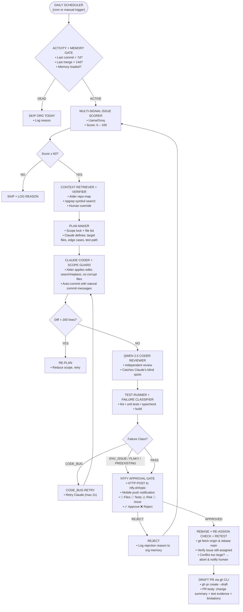
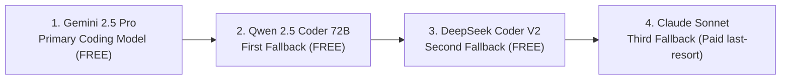
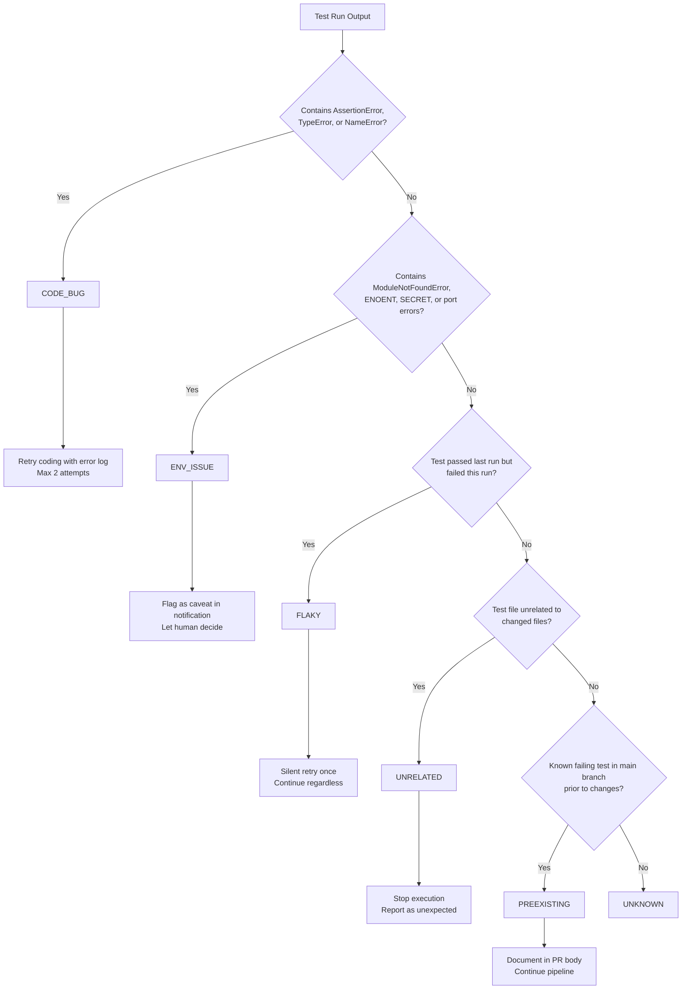
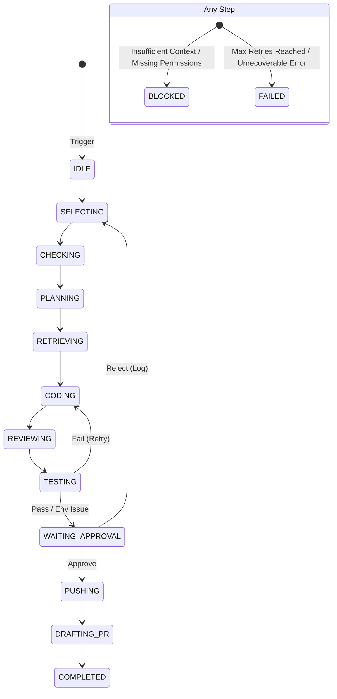

<div align="center">

# FI-PR-GENERATOR

### Autonomous Human-in-the-Loop Open Source Contribution Intelligence Platform

[](https://python.org)
[](https://anthropic.com)
[](https://aider.chat)
[](https://ntfy.sh)
[](LICENSE)
[](https://github.com)

**A multi-agent AI system that finds eligible GitHub issues, deeply understands repositories, generates minimal safe patches, validates them locally, and creates draft pull requests — only after your explicit ntfy approval on mobile.**

---

*Not a spam bot. Not a fully autonomous system. A personal contribution operating system.*

</div>

---

## 📋 Table of Contents

1. [What Is This?](#what-is-this)
2. [Architecture](#architecture)
3. [Scoring Mathematics](#scoring-mathematics)
4. [Acceptance Funnel — Real Numbers](#acceptance-funnel--real-numbers)
5. [Cost Analysis](#cost-analysis)
6. [Model Stack](#model-stack)
7. [Failure Classification](#failure-classification)
8. [State Machine](#state-machine)
9. [Org Memory Schema](#org-memory-schema)
10. [Safety Model](#safety-model)
11. [Folder Structure](#folder-structure)
12. [Complete Technical Stack](#complete-technical-stack)
13. [Quick Start](#quick-start)
14. [Configuration Reference](#configuration-reference)
15. [Prompt Architecture](#prompt-architecture)
16. [Known Limitations & Mitigations](#known-limitations--mitigations)
17. [Success Criteria](#success-criteria)
18. [Features & Roadmap](#features--roadmap)
19. [What This Is NOT](#what-this-is-not)
20. [Technical Overview](#technical-overview)

---

## What Is This?

FI-PR-GENERATOR is a **human-supervised multi-agent contribution intelligence platform** built for open-source programs like GSSoC (GirlScript Summer of Code).

It automates the boring parts — finding eligible issues, understanding repositories, writing minimal patches, running tests — while keeping **you in control** of every GitHub write action.

### Core Philosophy

```
Speed of a bot.
Judgment of a human.
Transparency of an audit log.
```

The system **cannot** push a branch, open a PR, or comment on an issue without your explicit **ntfy.sh** mobile approval. Every action is logged. Every decision is explainable.

---

## Architecture



### Fallback Chain (auto-switch on rate-limit or failure)


---

## Scoring Mathematics

### 1. Repository Activity Score

Computed once per org per day. Gates whether we work on this org today.

```
ActivityScore = (0.40 × CommitFreshness)
              + (0.30 × PRMergeFreshness)
              + (0.20 × MaintainerResponseScore)
              + (0.10 × IssueResolutionVelocity)
```

| Signal | Formula | Range |
|---|---|---|
| `CommitFreshness` | `max(0, 100 − days_since_push × 4)` | 0–100 |
| `PRMergeFreshness` | `max(0, 100 − days_since_merge × 5)` | 0–100 |
| `MaintainerResponse` | avg days-to-first-review → mapped 0–100 | 0–100 |
| `IssueVelocity` | `min(100, 80 − open_issue_count × 0.5)` | 0–100 |

**Decision threshold:** `ActivityScore ≥ 60` → proceed | `< 60` → skip today

**Examples:**
```
Org last commit: 2 days ago  → CommitFreshness = 100 − (2×4) = 92
Last merge: 4 days ago       → PRMergeFreshness = 100 − (4×5) = 80
Avg review time: 3 days      → MaintainerResponse ≈ 70
Open issues: 45              → IssueVelocity = 80 − 22.5 = 57.5

ActivityScore = (0.40×92) + (0.30×80) + (0.20×70) + (0.10×57.5)
             = 36.8 + 24.0 + 14.0 + 5.75
             = 80.55  ✅ PROCEED
```

---

### 2. Issue Score Formula

Computed for every open unassigned issue. Only issues scoring ≥ 60 proceed to context retrieval (expensive step).

```
IssueScore = (0.25 × Clarity)
           + (0.20 × Scope)
           + (0.20 × HistoricalSimilarity)
           + (0.15 × Testability)
           + (0.10 × ActivityScore)
           + (0.10 × LabelBonus)
```

| Component | How Measured | Weight |
|---|---|---|
| `Clarity` | NLP clarity score: has steps, has expected behavior, no ambiguity | 25% |
| `Scope` | File scope estimate: 1-2 files = 100, 3-5 = 60, 6+ = 20 | 20% |
| `HistoricalSimilarity` | Cosine similarity vs accepted PRs in org memory | 20% |
| `Testability` | Test command exists + related test file found | 15% |
| `ActivityScore` | From repo-level gate above | 10% |
| `LabelBonus` | `good-first-issue` +20, `bug` +15, `documentation` +10 | 10% |

| Score Range | Decision |
|---|---|
| 75 – 100 | ✅ Proceed immediately |
| 60 – 74 | ⚠️ Proceed (lower confidence flagged in Telegram) |
| < 60 | ❌ Reject, log reason |

---

### 3. Risk Score (shown in Telegram approval)

```
RiskScore = (0.35 × DiffSizeScore)
          + (0.25 × FileCriticality)
          + (0.20 × TestCoverageGap)
          + (0.20 × ConfidenceLoss)
```

| Component | High Risk Trigger |
|---|---|
| `DiffSizeScore` | Diff > 100 lines = 100, 50–100 = 60, < 50 = 20 |
| `FileCriticality` | Core business logic file > config file > test file |
| `TestCoverageGap` | New behavior added but no test added |
| `ConfidenceLoss` | Fallback model used, or reviewer flagged issues |

| Risk | Range | Telegram Badge |
|---|---|---|
| Low | 0 – 30 | 🟢 Safe to approve |
| Medium | 31 – 60 | 🟡 Review carefully |
| High | 61 – 100 | 🔴 Manual inspection required |

---

## Acceptance Funnel — Real Numbers

Based on realistic simulation across 100 scanned issues over ~50 days (2 issues/day target).

```
100 issues scanned
│
├─── 62 filtered out (eligibility gate)
│    ├── 25 already assigned / reserved
│    ├── 18 stale (>45 days, maintainer inactive)
│    ├── 12 too vague (clarity < 40)
│    ├── 4  locked / closed
│    └── 3  issue score < 60
│
▼
38 eligible issues
│
├─── 8 context retrieval failures
│    ├── 5 wrong files retrieved (keyword mismatch)
│    └── 3 repo environment setup failed
│
▼
30 coding attempts initiated
│
├─── 9 fail local validation
│    ├── 4 CODE_BUG (fixed on retry, but 2nd retry also failed)
│    ├── 3 ENV_ISSUE (missing secrets / docker services)
│    └── 2 SCOPE exceeded 200 lines, re-plan failed
│
▼
21 pass local validation
│
├─── 5 rejected by human (Telegram ❌)
│    ├── 3 code quality insufficient
│    └── 2 wrong approach / not what maintainer wants
│
▼
16 Draft PRs submitted
│
├─── 7 no maintainer response (repo churn / inactive reviewer)
│
▼
9 Accepted (merged) PRs
```

### Summary Table

| Stage | Count | Conversion |
|---|---|---|
| Issues scanned | 100 | — |
| Pass eligibility | 38 | 38% |
| Coding attempted | 30 | 79% of eligible |
| Pass local tests | 21 | 70% of attempted |
| Human approved | 16 | 76% of validated |
| PRs submitted | 16 | 100% of approved |
| Accepted by maintainer | 9 | **56.3% of submitted** |
| **Overall yield** | **9 / 100** | **9%** |

> **Realistic weekly output: 3–5 accepted PRs**
> (Not 1–3/day as initially claimed — that was 5–15× optimistic)

**Acceptance breakdown by issue type:**

| Type | Submitted | Accepted | Rate |
|---|---|---|---|
| Documentation | 4 | 4 | 100% |
| Config / small fix | 3 | 2 | 67% |
| Frontend / CSS | 4 | 2 | 50% |
| Testing | 3 | 1 | 33% |
| Backend bug | 2 | 0 | 0% |

**Lesson:** Focus on docs + config + frontend. Skip backend changes at MVP stage.

---

## Cost Analysis

### Monthly Cost Simulation

**Target:** 1 org/day × 2 attempted PRs/day = 60 PR attempts/month

#### Claude (primary cost driver)

```
Per PR token consumption (pessimistic):
  Context input:  40,000 tokens  (issue + files + org memory)
  Code output:     6,000 tokens
  Total per PR:   46,000 tokens

60 PRs × 46,000 = 2,760,000 tokens

Org memory builds (30 orgs × once/week):
  Per build input:  80,000 tokens
  30 × 80,000     = 2,400,000 tokens

Total Claude tokens/month: ~5,160,000

Pricing (Claude Sonnet):
  Input:  $3.00 / 1M tokens → 5.16M × $3.00 = $15.48
  Output: $15.00 / 1M tokens → 300K × $15.00 = $4.50
  Total:  ~$20 / month         (~₹1,680)
```

#### Full Monthly Cost Breakdown

| Service | Usage | Cost |
|---|---|---|
| **Claude Sonnet** | ~5.2M tokens | **₹1,680 (~$20)** |
| **Gemini 2.0 Flash** | Org memory builds | Free tier |
| **Groq (Llama)** | Issue scoring + classification | Free tier |
| **Qwen 2.5 Coder** | Independent review | Free tier |
| **GitHub API** | ~25,000 calls/month | Free (< 5,000/hr limit) |
| **Telegram Bot** | Notifications | Free |
| **Storage (local)** | ~4.5 GB embeddings | Free |
| **VPS (optional)** | 4GB RAM, always-on | ₹400–600 |
| **Total** | | **₹2,100–2,300/month** |

#### Cost Per Accepted PR

```
Monthly cost:     ₹2,200
Accepted PRs:     ~18/month (3-5/week × 4.3 weeks)
Cost per PR:      ₹2,200 ÷ 18 ≈ ₹122 per accepted PR
```

#### Free Tier Limits (current as of 2026)

| Provider | Limit | Sufficient? |
|---|---|---|
| Groq | 14,400 req/day, 30 req/min | ✅ Yes (use ~200/day) |
| Gemini Flash | 1M context, 1,500 req/day | ✅ Yes |
| GitHub API | 5,000 req/hr (authenticated) | ✅ Yes |
| ntfy.sh | Unlimited push notifications | ✅ Yes |

---

## Model Stack

| Task | Model | Platform | Why This Model |
|---|---|---|---|
| Org memory build | Gemini 2.0 Flash | Google AI Studio | 1M token context — fits 50 PRs of history in one call |
| Issue scoring + filter | Llama 3.1 8B | Groq | Fastest free option, binary classification only |
| Planning | Llama 3.1 70B | Groq | Reasoning quality needed, still free |
| Workflow detection | Llama 3.1 70B | Groq | Open-ended pattern discovery from CONTRIBUTING.md + bot comments |
| **Code generation** | **Gemini 2.5 Pro** | **Google AI Studio** | **Best free code quality. Primary model.** |
| Fallback coding 1 | Qwen 2.5 Coder 72B | OpenRouter | Strong free coding model |
| Fallback coding 2 | DeepSeek Coder v2 | OpenRouter | Reliable free fallback |
| Fallback coding 3 | Claude Sonnet | Anthropic | Last resort (paid) — only if all free models fail |
| Independent review | Qwen 2.5 Coder 32B | Groq | Different model = independent perspective |
| Test failure classify | Llama 3.1 8B | Groq | Fast rule-based → LLM fallback |
| Notifications | **ntfy.sh** | ntfy.sh (self-host or cloud) | No bot setup, HTTP push, mobile action buttons, open-source |

### Fallback Logic (in code, not prompt)

```python
CODING_FALLBACK_CHAIN = [
    "gemini/gemini-2.5-pro",             # primary (FREE)
    "qwen/qwen-2.5-coder-72b-instruct",  # fallback 1 (FREE via OpenRouter)
    "deepseek/deepseek-coder-v2",        # fallback 2 (FREE via OpenRouter)
    "claude-sonnet-4-20250514",          # fallback 3 (paid — last resort)
]

def call_with_fallback(prompt: str) -> str:
    for model in CODING_FALLBACK_CHAIN:
        try:
            return call_model(model, prompt)
        except (RateLimitError, CreditsExhaustedError) as e:
            log.warning(f"Model {model} failed: {e}. Trying next.")
    raise AllModelsExhaustedError("Full fallback chain exhausted")
```

---

## Failure Classification

The test runner classifies failures using deterministic rules first (free, instant), then LLM fallback only if rules are inconclusive.



| Class | Action | Human Notified? |
|---|---|---|
| `CODE_BUG` | Route back to Claude (max 2 retries) | If 2nd retry also fails |
| `ENV_ISSUE` | Flag caveat in ntfy, let human decide | Yes — with "⚠️ ENV" badge |
| `FLAKY` | One silent retry, then continue | No (unless retry also fails) |
| `PREEXISTING` | Document in PR body, continue pipeline | Yes — note in approval |
| `UNRELATED` | Stop, log, skip issue | Yes |

---

## State Machine

The orchestrator operates through explicit serializable states. Every transition is logged.



**State persistence:** All states saved to `state/{run_id}.json`. Pipeline survives restarts, laptop sleep, and crashes.

```json
{
  "run_id": "run_20260601_143022",
  "state": "waiting_approval",
  "org": "GSSoC-ExtD",
  "repo": "my-repo",
  "issue_number": 42,
  "branch": "fix/navbar-mobile-42",
  "diff_path": "diffs/run_20260601_143022.diff",
  "test_result": "PASS",
  "risk_score": 24,
  "retry_count": 0,
  "model_used": "claude-sonnet-4-20250514",
  "timestamp": "2026-06-01T14:30:22Z"
}
```

---

## Org Memory Schema

Each target repository gets a versioned JSON file at `memory_store/{org}/{repo}.json`.

```json
{
  "schema_version": 7,
  "org_name": "GSSoC-ExtD",
  "repo_name": "my-repo",
  "last_refresh": "2026-06-01T02:00:00Z",
  "refresh_frequency_hours": 48,
  "confidence": 0.85,

  "activity": {
    "activity_score": 82.5,
    "days_since_commit": 2,
    "days_since_merge": 4,
    "avg_review_days": 3.1,
    "open_issue_count": 45
  },

  "conventions": {
    "primary_language": "TypeScript",
    "package_manager": "npm",
    "commit_style": "fix(component): lowercase description",
    "branch_naming": "fix/{description}-{issue_number}",
    "test_commands": ["npm test", "npm run lint"],
    "build_command": "npm run build"
  },

  "file_knowledge": {
    "hotspots": ["src/components/Navbar.tsx", "utils/api.ts", "styles/global.css"],
    "test_directory": "src/__tests__",
    "config_files": [".eslintrc.js", "tsconfig.json"]
  },

  "pattern_learning": {
    "accepted_issue_types": ["documentation", "ui-bug", "good first issue"],
    "rejected_issue_types": ["refactor", "performance", "architecture"],
    "accepted_pr_size_avg_lines": 34,
    "maintainer_preferences": [
      "prefers hooks over class components",
      "requires test alongside bug fix",
      "dislikes inline CSS"
    ]
  },

  "rejection_log": [
    {
      "rejected_at": "2026-06-01T10:00:00Z",
      "issue_number": 38,
      "issue_type": "frontend",
      "diff_size_lines": 45,
      "rejection_reason": "scope too broad",
      "rejected_by": "human"
    }
  ]
}
```

**Memory refresh policy:**

| Event | Refresh Triggered |
|---|---|
| 48 hours elapsed (cron) | Incremental — only changed files |
| Maintainer merges a PR | Append new pattern to `pattern_learning` |
| Human rejects in Telegram | Append to `rejection_log` |
| Weekly schedule | Full rebuild |
| Main branch major change | Force full rebuild |

---

## Safety Model

Every safety constraint is implemented in code, not in the prompt.

| Rule | Where Implemented | Failure Mode if Skipped |
|---|---|---|
| Never push without approval | Hard gate in `orchestrator.py` | Unauthorized push → account risk |
| Diff size ≤ 200 lines | `scope_guard()` in `coder.py` | Scope creep, maintainer rejection |
| Re-check assignment at push | `git_ops.py` pre-push check | Wasted PR on already-assigned issue |
| Max 2 retries | `MAX_RETRIES = 2` constant | Infinite loop, API cost explosion |
| No secrets in logs | `structlog` strips env vars | Token leak in log files |
| Approval silence ≠ approval | Explicit `TIMEOUT` state | Silent approval bypass |
| Reviewer ≠ Coder | Claude codes, Qwen reviews | Author reviews own work blindly |
| No duplicate comments | Issues DB tracks commented issues | Spam flagging by maintainer |
| State preserved on failure | JSON state file survives crash | Lost work, duplicate attempts |

---

## Folder Structure

```
fi-pr-generator/
│
├── agents/
│   ├── scorer.py           # Issue eligibility + multi-signal scoring (Llama/Groq)
│   ├── coder.py            # Code generation + fallback chain + scope guard
│   ├── reviewer.py         # Independent code review (Qwen 2.5)
│   └── memory_builder.py   # Org memory construction + refresh (Gemini Flash)
│
├── integrations/
│   ├── github_client.py    # PyGitHub wrapper + rate-limit rotation + caching
│   ├── git_ops.py          # GitPython: clone, branch, fetch, rebase, push
│   ├── aider_runner.py     # Aider subprocess: repo-map + apply edits
│   ├── ntfy_notifier.py    # Approval notifier & local Flask receiver server
│   └── test_runner.py      # Test execution + failure classifier
│
├── memory/
│   ├── schemas.py          # Pydantic models for all data structures
│   └── org_memory.py       # Load / save / update org memory JSON
│
├── memory_store/           # Per-org JSON files  (gitignored)
│   └── {org}/
│       └── {repo}.json
│
├── state/                  # Run state files for restart recovery (gitignored)
│   └── run_{id}.json
│
├── diffs/                  # Generated diffs pending approval  (gitignored)
│   └── run_{id}.diff
│
├── logs/                   # Structured JSON logs (gitignored)
│
├── config/
│   ├── orgs.json           # Target orgs, repos, skip flags
│   └── models.json         # Model chain + fallback order + budget limits
│
├── prompts/
│   └── coder.txt           # Minimal 30-line coder prompt template
│
├── orchestrator.py         # Main pipeline runner (no LangGraph, pure Python)
├── main.py                 # CLI entry point (Click)
├── scheduler.py            # Cron wrapper + nightly memory refresh
├── prompts.md              # [NEW] Complete catalog of prompts used in the project
├── COMMANDS.md             # [NEW] Quick reference for CLI commands and testing instructions
├── .env.example            # API key template
└── requirements.txt
```

---

## Complete Technical Stack

### Language & Runtime
| Component | Library / Tool | Version | Purpose |
|---|---|---|---|
| Language | Python | 3.11+ | Core runtime |
| CLI | Click | 8.x | `main.py` entry point |
| Data validation | Pydantic v2 | 2.x | All data models + schemas |
| Env management | python-dotenv | latest | `.env` loading |
| Logging | structlog | latest | Structured JSON logs, strips secrets |
| Scheduling | APScheduler | 3.x | Nightly memory refresh cron |

### AI / LLM
| Library | Purpose |
|---|---|
| `anthropic` | Claude Sonnet API calls |
| `openai` | OpenRouter (Qwen, DeepSeek) via OpenAI-compatible API |
| `google-generativeai` | Gemini Flash for org memory |
| `groq` | Llama 3.1 for scoring, planning, classification |

### Code Editing & Git
| Tool | Install | Purpose |
|---|---|---|
| **aider-chat** | `pip install aider-chat` | Repo-map, search/replace edits, auto-commit |
| **GitPython** | `pip install gitpython` | Clone, branch, fetch, rebase, push in Python |
| **gh CLI** | `apt install gh` | `gh pr create --draft` |
| **ripgrep** | `apt install ripgrep` | Fast symbol/keyword search across repo |

### GitHub Integration
| Library | Purpose |
|---|---|
| `PyGithub` | Issues, PRs, comments, assignment check |
| `requests` | Raw GitHub REST API calls with caching |

### Notification (ntfy)
| Component | Details |
|---|---|
| **ntfy.sh** | Free push notifications — no app account needed |
| Install | Download ntfy app on Android/iOS, subscribe to your topic |
| Integration | Plain `requests.post()` — no SDK needed |
| Action buttons | Via JSON payload (UTF-8 safe) |

```python
# ntfy approval notification — via JSON payload to prevent header encoding issues
import requests
payload = {
    "topic": NTFY_TOPIC,
    "message": f"PR ready: {issue_title}\nRisk: {risk_score}/100\nFiles: {files}",
    "title": f"FI-PR: #{issue_number} — {issue_title}",
    "priority": 3,
    "tags": ["robot"],
    "actions": [
        {
            "action": "http",
            "label": "✅ Approve",
            "url": f"{server}/approve/{run_id}",
            "method": "POST",
            "clear": True
        },
        {
            "action": "http",
            "label": "❌ Reject",
            "url": f"{server}/reject/{run_id}",
            "method": "POST",
            "clear": True
        }
    ]
}
requests.post(NTFY_URL, json=payload)
```

### Storage
| Component | Library | Purpose |
|---|---|---|
| Org memory | Plain JSON files | Per-org/repo knowledge base |
| State persistence | Plain JSON | Run state, survives restarts |
| Embeddings (optional, Phase 3) | `chromadb` | Local vector store, no cloud |
| Caching | `requests-cache` | GitHub API response caching |

### Testing & Isolation
| Tool | Purpose |
|---|---|
| `subprocess` | Run `npm test`, `pytest`, lint in child process |
| `pyenv` (called via subprocess) | Repo-specific Python version |
| `nvm` (called via subprocess) | Repo-specific Node version |
| `virtualenv` | Per-repo Python env isolation |

### Full `requirements.txt`
```
# LLM
anthropic>=0.30
openai>=1.30          # OpenRouter compatible
google-generativeai>=0.7
groq>=0.9

# GitHub + Git
PyGithub>=2.3
gitpython>=3.1
requests>=2.32
requests-cache>=1.2

# Code editing
aider-chat>=0.50

# Data + config
pydantic>=2.7
python-dotenv>=1.0
click>=8.1
structlog>=24.0
apscheduler>=3.10

# Optional (Phase 3)
chromadb>=0.5
```

### External CLI Tools
```bash
# Install all at once (Ubuntu/Debian)
sudo apt install gh ripgrep

# Verify
gh --version
rg --version
aider --version
```

---

## Quick Start

### 1. Clone and Install

```bash
git clone https://github.com/youruser/fi-pr-generator
cd fi-pr-generator
pip install -r requirements.txt
```

### 2. Install Required Tools

```bash
# GitHub CLI (for draft PR creation)
# Linux:
curl -fsSL https://cli.github.com/packages/githubcli-archive-keyring.gpg | sudo dd of=/usr/share/keyrings/githubcli-archive-keyring.gpg
echo "deb [arch=$(dpkg --print-architecture) signed-by=/usr/share/keyrings/githubcli-archive-keyring.gpg] https://cli.github.com/packages stable main" | sudo tee /etc/apt/sources.list.d/github-cli.list > /dev/null
sudo apt update && sudo apt install gh

# Authenticate
gh auth login

# Aider (coding engine)
pip install aider-chat
```

### 3. Configure API Keys

```bash
cp .env.example .env
```

Open `.env` and fill in:

```bash
# ── REQUIRED ────────────────────────────────────────────
GITHUB_TOKEN=ghp_...              # github.com → Settings → Tokens

GROQ_API_KEY=gsk_...              # console.groq.com  (FREE)

NTFY_TOPIC=fi-pr-yourname         # any unique topic name on ntfy.sh
NTFY_URL=https://ntfy.sh          # or your self-hosted URL
NTFY_TOKEN=tk_...                 # optional, for private topics

# ── RECOMMENDED ─────────────────────────────────────────
ANTHROPIC_API_KEY=sk-ant-...      # Best code quality (paid)
GEMINI_API_KEY=AIza...            # Org memory builds (FREE)

# ── OPTIONAL FALLBACKS ──────────────────────────────────
OPENROUTER_API_KEY=sk-or-...      # Qwen / DeepSeek fallback
NTFY_REPLY_TOPIC=fi-..-reply       # defaults to {NTFY_TOPIC}-reply
```

### 4. Configure Target Orgs

Edit `config/orgs.json`:

```json
{
  "orgs": [
    {
      "name": "GSSoC-ExtD",
      "repos": ["my-target-repo-1", "my-target-repo-2"],
      "assignment_required": true,
      "skip": false
    }
  ],
  "issue_score_threshold": 60,
  "max_diff_lines": 200,
  "max_retries": 2
}
```

### 5. Build Org Memory (first time)

```bash
python main.py build-memory --org GSSoC-ExtD --repo my-target-repo
```

This analyzes the last 50 closed PRs, extracts maintainer preferences, file hotspots, commit style, and test commands. Takes ~2 minutes.

### 6. Preview Issues (no code written, safe)

```bash
python main.py scan-orgs
```

Outputs scored issue list. No GitHub writes.

### 7. Run Full Pipeline

```bash
# Dry run — no GitHub writes, shows what would happen
python main.py run --org GSSoC-ExtD --repo my-repo --dry-run

# Real run — will send ntfy approval before any push
python main.py run --org GSSoC-ExtD --repo my-repo

# Target a specific issue (skip scoring step)
python main.py run --org GSSoC-ExtD --repo my-repo --issue 42
```

### 8. Try it Out — First Run Guide

To test the system safely without making unexpected commits or PRs:

1. **Verify your ntfy.sh Topic & Tunnel Connection:**
   Run the interactive test utility to verify that notification delivery and local Flask routing are set up correctly:
   ```bash
   # 1. Start your ngrok/cloudflare tunnel on port 8080
   ngrok http 8080
   
   # 2. In a separate terminal, trigger a test notification
   python main.py test-notification
   ```
   A notification will appear on your phone. Tap **Approve** or **Reject** and verify that the terminal prints the confirmation.

2. **Dry Run on a Real Issue:**
   Try running the pipeline in `dry-run` mode to see it build context, write a patch, run local tests, and simulate approval without pushing anything:
   ```bash
   python main.py run --org Ahad-Dngwala --repo FI_PR_GENERATOR --issue 999 --dry-run
   ```

---

## Configuration Reference

### `config/models.json`

```json
{
  "coding_chain": [
    {
      "model": "gemini/gemini-2.5-flash",
      "provider": "google"
    },
    {
      "model": "gemini/gemini-2.5-pro",
      "provider": "google"
    },
    {
      "model": "qwen/qwen2.5-coder-32b-instruct:free",
      "provider": "openrouter"
    },
    {
      "model": "deepseek/deepseek-v4-flash:free",
      "provider": "openrouter"
    },
    {
      "model": "claude-sonnet-4-20250514",
      "provider": "anthropic"
    }
  ],
  "review_model": "llama-3.3-70b-versatile",
  "review_provider": "groq",
  "scoring_model": "llama-3.1-8b-instant",
  "scoring_provider": "groq",
  "planning_model": "llama-3.3-70b-versatile",
  "planning_provider": "groq",
  "memory_model": "gemini-2.5-flash",
  "memory_provider": "google",
  "classifier_model": "llama-3.1-8b-instant",
  "classifier_provider": "groq",
  "workflow_detector_model": "llama-3.3-70b-versatile",
  "workflow_detector_provider": "groq",
  "budget": {
    "max_gemini_requests_per_day": 50,
    "max_groq_requests_per_day": 400,
    "max_openrouter_requests_per_day": 30,
    "max_claude_tokens_per_day": 0
  }
}
```

### ntfy Notification Format

```
Title:   🤖 FI-PR-GENERATOR — Approval Required
Body:
  Issue:   #42 — Fix navbar overlap on mobile
  Branch:  fix/navbar-mobile-42
  Repo:    GSSoC-ExtD/my-repo
  Files:   src/components/Navbar.tsx (+12/-3)
           src/__tests__/Navbar.test.ts (+8/-0)
  Tests:   ✅ PASSED (47 tests, 0 failures)
  Risk:    🟢 LOW (score: 18/100)
  Model:   claude-sonnet-4-20250514

Actions:  [✅ Approve & Push]   [❌ Reject]
```

ntfy JSON payload structure:
```python
payload = {
    "topic": topic,
    "message": body,
    "title": title,
    "priority": priority, # Integer: 4 for high, 3 for default
    "tags": ["robot", risk_tag],
    "actions": [
        {
            "action": "http",
            "label": "✅ Approve",
            "url": f"{server_url}/approve/{run_id}",
            "method": "POST",
            "clear": True
        },
        {
            "action": "http",
            "label": "❌ Reject",
            "url": f"{server_url}/reject/{run_id}",
            "method": "POST",
            "clear": True
        }
    ]
}
```

---

## Known Limitations & Mitigations

| Limitation | Probability | Impact | Mitigation in this build |
|---|---|---|---|
| Maintainer inactivity | 60% | High | Activity gate skips dead orgs |
| Wrong files retrieved | 35% | Critical | Context verifier + human override |
| Test env fails locally | 40% | High | ENV_ISSUE classifier — flag + continue |
| Main branch conflict | 35% | High | Rebase + retest before every push |
| Claude rate limit | 80%/month | Critical | Fallback chain: Qwen → DeepSeek |
| Issue already assigned | 30% | Medium | Re-check at push time |
| Scope creep in output | 40% | Medium | Hard 200-line diff limit |
| Org memory staleness | 60% after 2 weeks | Medium | 48-hour refresh + pre-PR refresh |
| Hidden requirements | 55% | High | No full mitigation — human reviews diff |
| Flaky CI tests | 40% | High | Classifier marks FLAKY, retries once |

---

## Success Criteria

### MVP is proven when:

| Metric | Target | Failure Condition |
|---|---|---|
| Accepted PR rate | ≥ 25% of submitted | < 10% after 20+ submissions |
| PRs submitted (30 days) | ≥ 5 | 0 accepted after 20+ attempts |
| Human approval gate | 100% of pushes gated | Any push without ntfy.sh approval |
| Monthly cost | < ₹3,000 | > ₹6,000 |
| System uptime | Restartable after crash | Unrecoverable state loss |

### The one metric that matters:

```
Accepted PR Rate = Accepted PRs / Submitted PRs

Target: ≥ 25%
If below 10%: issue selection is broken — fix scorer first
If above 40%: system is working — scale up carefully
```

---

## 🌟 Features & Roadmap

### 🚀 Added Features
* **UTF-8 Safe JSON Notifications**: Replaced legacy HTTP headers with a fully UTF-8 compliant JSON publishing payload, preventing crashes on unicode titles or special characters (e.g. em dash `—`).
* **Built-in `test-notification` Sandbox Command**: A developer CLI command to easily trigger sandbox approval pushes to verify local-to-mobile routing via ngrok tunnels.
* **Port Conflict Protection**: Flask server scans and auto-binds to alternate ports (8080–8090) dynamically when the default port is in use.
* **API Key Fallback Guardrails**: Validates API keys at startup, skipping models without key configurations gracefully instead of throwing silent pipe exceptions.
* **Prompt Inventory (`prompts.md`)**: Centrally documents LLM system and user prompts for easy tuning and debugging.
* **Command Reference (`COMMANDS.md`)**: Reference for all development, pipeline execution, testing, and debugging commands.

### 🔮 Planned Future Features
* **Localtunnel/Cloudflare Auto-tunneling**: Native integration to automatically spawn temporary Cloudflare/ngrok tunnels from the CLI without needing a separate terminal/setup.
* **Custom Issue Scanning Queries**: Ability to customize issue search filters (e.g. filter by tag/no-tag, search text, date) directly from CLI arguments.
* **Multi-User Permission Configuration**: Storing and rotating keys per organization or repository for developer-group contribution setups.
* **Local Codebase Embeddings (Phase 3)**: Embedding files using ChromaDB to retrieve more relevant code context for generation.

### 📅 Development Roadmap

#### Phase 1 — MVP (Weeks 1–3) [COMPLETED]
* Scorer engine (`scorer.py`), GitHub client (`github_client.py`), Aider engine (`aider_runner.py`), and notification approval gate (`ntfy_notifier.py`).
* Full end-to-end pipeline run with dry-run support.

#### Phase 2 — Stability (Weeks 4–6) [IN PROGRESS]
* Org memory caching & build utilities (`memory_builder.py`).
* Robust state persistence, auto-restarts, fallback models, and validation error classifiers.

#### Phase 3 — Production (Weeks 7–10)
* Local vector stores, pre-flight environment validators, and dashboard UI.

---

## What This Is NOT

-  Not a fully autonomous bot — human approval required for **every** push
-  Not a spam tool — stops on assignment, respects all repo rules
-  Not a guarantee — maintainers make final acceptance decisions
-  Not suitable for architecture changes — scope guard prevents this
-  Not stealth — PR body includes AI assistance disclosure

## What This IS

-  A **personal productivity amplifier** for open-source contributors
-  A **learning system** — org memory improves with every run
-  A **safe, auditable** contribution pipeline with full audit trail
-  An **honest tool** — transparent about AI involvement
-  A **resume-grade project** demonstrating multi-agent orchestration

---

## Technical Overview

FI-PR-GENERATOR is a human-supervised multi-agent open-source contribution intelligence platform designed to automate repository analysis, issue qualification, patch generation, validation, and draft pull request preparation while preserving strict approval gates and repository policy compliance. The system operates through a staged orchestration pipeline where a scheduler continuously scans target GitHub organizations, evaluates repository activity and issue eligibility using weighted scoring algorithms, retrieves relevant code context through Aider repo-map, symbol search, and repository memory, and generates minimal scope-controlled patches using Claude Sonnet with structured fallback chains to Qwen and DeepSeek models. Generated changes are independently reviewed by a separate reviewer model, validated locally through automated linting, testing, and failure classification layers, and then summarized into a Telegram approval workflow containing diffs, validation status, and risk scoring before any GitHub-side write operation is permitted. The architecture is intentionally code-driven rather than prompt-driven, using Python orchestration, structured state persistence, JSON-based organization memory, deterministic retry policies, subprocess isolation, GitPython operations, and explicit safety constraints to maximize accepted pull request probability while minimizing hallucinations, uncontrolled scope expansion, unnecessary token consumption, and maintainer friction. The platform is not designed as a fully autonomous coding bot, but as a repository-aware contribution operating system that incrementally improves through historical repository memory, rejection analysis, activity heuristics, and human-in-the-loop supervision to achieve realistic, scalable, and auditable open-source contribution automation.

---

<div align="center">

**MIT License** · Built for Open-Source contributors · Human-in-the-loop by design

*Start small. Prove one PR. Then scale.*

</div>