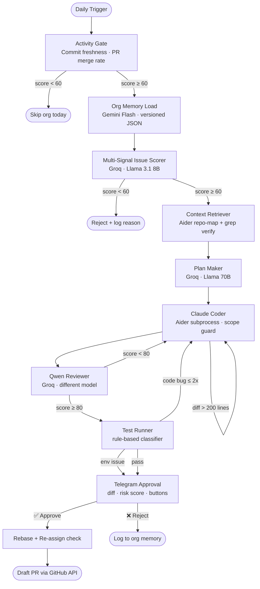

# FI-PR-GENERATOR

> **Autonomous Human-in-the-Loop Open Source Contribution Intelligence Platform**

A multi-agent AI system that finds eligible GitHub issues, understands repositories deeply, generates minimal safe patches, validates them locally, and creates draft pull requests — only after your explicit approval via Telegram.

```
Daily Trigger → Activity Gate → Issue Scorer → Context Retriever
    → Claude Coder + Scope Guard → Qwen Reviewer → Test Runner
    → Telegram Approval → Rebase Check → Draft PR
```

---

## Architecture



---

## Scoring Mathematics

### Repository Activity Score

```
ActivityScore = 0.40 × CommitFreshness
              + 0.30 × PRMergeFreshness
              + 0.20 × MaintainerResponseScore
              + 0.10 × IssueResolutionVelocity
```

| Signal | Formula | Max |
|---|---|---|
| CommitFreshness | `max(0, 100 - days_since_push × 4)` | 100 |
| PRMergeFreshness | `max(0, 100 - days_since_merge × 5)` | 100 |
| MaintainerResponse | avg days-to-first-comment → score | 100 |
| IssueVelocity | `min(100, 80 - open_issues × 0.5)` | 100 |

**Threshold:** Score ≥ 60 → proceed. Score < 60 → skip today.

### Issue Score Formula

```
IssueScore = 0.25 × Clarity
           + 0.20 × Scope
           + 0.20 × HistoricalSimilarity
           + 0.15 × Testability
           + 0.10 × ActivityScore
           + 0.10 × LabelBonus
```

| Range | Decision |
|---|---|
| 75–100 | ✅ Proceed immediately |
| 60–74 | ⚠️ Manual review advised |
| < 60 | ❌ Reject |

### Risk Score (sent in Telegram)

```
RiskScore = 0.35 × DiffSizeScore
          + 0.25 × FileCriticality
          + 0.20 × TestCoverageGap
          + 0.20 × ConfidenceLoss
```

| Risk | Level | Telegram badge |
|---|---|---|
| 0–30 | Low | 🟢 |
| 31–60 | Medium | 🟡 |
| 61–100 | High | 🔴 |

---

## Model Stack

| Task | Model | Platform | Cost |
|---|---|---|---|
| Org memory build | Gemini 2.0 Flash | Google AI Studio | Free tier |
| Issue scoring | Llama 3.1 8B | Groq | Free |
| Planning | Llama 3.1 70B | Groq | Free |
| Code generation | Claude Sonnet 4.5 | Anthropic | ~₹2000/month |
| Fallback coding | Qwen 2.5 Coder 72B | OpenRouter | Pay-per-use |
| Second fallback | DeepSeek Coder v2 | OpenRouter | Pay-per-use |
| Independent review | Qwen QwQ 32B | Groq | Free |
| Failure classify | Llama 3.1 8B | Groq | Free |
| Notifications | Telegram Bot | Telegram | Free |

**Total estimated monthly cost: ₹1800–2500** (Claude is the only significant expense)

---

## Acceptance Funnel (Realistic Simulation)

```
100 Issues scanned
    ↓  62 filtered (assigned / stale / vague / bad labels)
38 eligible issues
    ↓  8 context retrieval failures
30 coding attempts
    ↓  9 fail tests (env issues, wrong context)
21 pass local validation
    ↓  5 rejected by human (quality check)
16 Draft PRs submitted
    ↓  7 no maintainer response (active repos only)
 9 Accepted PRs  →  56.25% acceptance rate on submitted
```

**Pipeline yield: 9% of scanned issues → accepted PR**
**Realistic weekly output: 3–5 accepted PRs** (not 1–3/day as initially claimed)

---

## Failure Classification

The test runner classifies failures using **rules first** (fast, free) with LLM fallback:

| Class | Example | Action |
|---|---|---|
| `CODE_BUG` | `AssertionError`, `TypeError` | Route back to coder (max 2 retries) |
| `ENV_ISSUE` | `ModuleNotFoundError`, missing secret | Flag caveat, continue to human |
| `FLAKY` | Timeout, socket hang | Retry once |
| `PREEXISTING` | Known failing test | Document in PR body, continue |
| `UNRELATED` | CI test in different module | Stop, report |

---

## Quick Start

### 1. Install

```bash
git clone https://github.com/youruser/fi-pr-generator
cd fi-pr-generator
pip install -r requirements.txt
```

### 2. Configure

```bash
cp .env.example .env
# Edit .env with your API keys
```

**Minimum required keys:**
```
GITHUB_TOKEN=ghp_...
GROQ_API_KEY=gsk_...         # free at console.groq.com
TELEGRAM_BOT_TOKEN=...       # @BotFather on Telegram
TELEGRAM_CHAT_ID=...         # @userinfobot on Telegram
```

**Optional (recommended):**
```
ANTHROPIC_API_KEY=sk-ant-... # Claude (best code quality)
GEMINI_API_KEY=AIza...       # org memory building
```

### 3. Build Org Memory

```bash
python main.py build-memory --org GSSoC-ExtD --repo my-target-repo
```

### 4. Scan Issues (no coding, safe preview)

```bash
python main.py scan-orgs
```

### 5. Run Full Pipeline

```bash
# Dry run first (no GitHub writes)
python main.py run --org GSSoC-ExtD --repo my-repo --dry-run

# Real run
python main.py run --org GSSoC-ExtD --repo my-repo

# Specific issue
python main.py run --org GSSoC-ExtD --repo my-repo --issue 42
```

---

## Folder Structure

```
fi-pr-generator/
│
├── agents/
│   ├── scorer.py          # Issue scoring (Groq/Llama)
│   ├── coder.py           # Code generation + fallback chain
│   ├── reviewer.py        # Independent review (Qwen)
│   └── memory_builder.py  # Org memory (Gemini + rules)
│
├── integrations/
│   ├── github_client.py   # PyGitHub + rate-limit rotation
│   ├── git_ops.py         # GitPython: clone/branch/push
│   ├── aider_runner.py    # Aider subprocess + repo-map
│   ├── telegram_bot.py    # Approval bot + risk scoring
│   └── test_runner.py     # Tests + failure classifier
│
├── memory/
│   ├── schemas.py         # All Pydantic data models
│   └── org_memory.py      # Load/save/update org memory
│
├── memory_store/          # Per-org JSON files (gitignored)
├── config/
│   ├── orgs.json          # Target orgs + settings
│   └── models.json        # Model chain + fallbacks
│
├── orchestrator.py        # Main pipeline (no LangGraph)
├── main.py                # CLI entry point
├── .env.example           # API key template
└── requirements.txt
```

---

## Org Memory Schema

Each repository gets a versioned JSON file in `memory_store/{org}/{repo}.json`:

```json
{
  "version": 7,
  "org_name": "GSSoC-ExtD",
  "repo_name": "my-repo",
  "activity_score": 82.5,
  "commit_style": "fix(component): description",
  "common_test_commands": ["npm test", "pytest"],
  "common_file_hotspots": ["src/components/Navbar.tsx", "utils/api.ts"],
  "issue_acceptance_patterns": ["documentation", "bug", "good first issue"],
  "issue_rejection_patterns": ["human_flagged_low_quality"],
  "rejection_log": [
    {
      "rejected_at": "2026-06-01T10:00:00",
      "issue_type": "frontend",
      "diff_size": 45,
      "rejection_reason": "scope too broad"
    }
  ],
  "last_refresh": "2026-06-01T02:00:00",
  "confidence": 0.85
}
```

Memory is **never stale by design** — refreshed every 48 hours, version-bumped on every write, rejection log improves future scoring automatically.

---

## Safety Model

| Rule | Implementation |
|---|---|
| Never push without approval | Hard gate in `orchestrator.py` |
| Never exceed diff size | Scope guard counts lines, resets on violation |
| Never work on assigned issues | Live API re-check at push time |
| Never store secrets in logs | structlog strips env vars |
| Never bypass approval on timeout | Returns `TIMEOUT` state, preserves local state |
| Reviewer ≠ Coder | Claude codes, Qwen reviews — different training |
| Max 2 retries | Hard-coded `MAX_RETRIES = 2` in code |

---

## State Machine

```
idle → selecting → checking → planning → retrieving
     → coding → reviewing → testing → waiting_approval
     → pushing → drafting_pr → completed
                                     ↓
              blocked ← failed ←────┘ (at any step)
```

All states are serializable. Pipeline survives restarts.

---

## MVP Success Criteria

| Metric | Target | Failure |
|---|---|---|
| Accepted PR rate | ≥ 25% of submitted | < 10% |
| PRs submitted (30 days) | ≥ 5 | 0 accepted after 20+ attempts |
| Human approval usage | 100% of pushes | Any push without approval |
| Cost | < ₹3000/month | > ₹5000/month |

---

## What This Is NOT

- ❌ Not fully autonomous (human approval required for every push)
- ❌ Not a spam bot (stops on assignment, respects repo rules)
- ❌ Not guaranteed to get PRs merged (maintainers decide)
- ❌ Not suitable for complex architecture changes (scope guard prevents this)

## What This IS

- ✅ A personal productivity amplifier for open-source contributors
- ✅ A learning system (org memory improves with every run)
- ✅ A safe, auditable, human-supervised contribution pipeline
- ✅ An honest system (PR body discloses AI assistance)

---

## License

MIT — use freely, contribute back.
